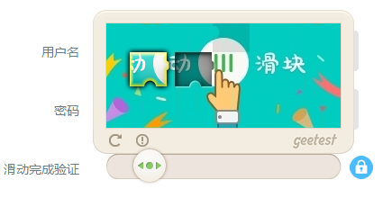
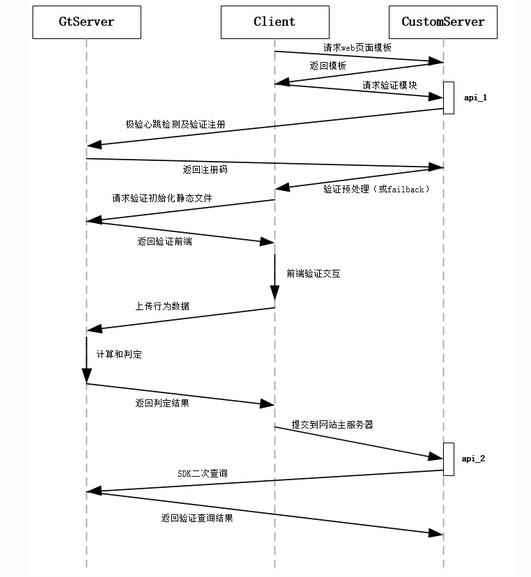
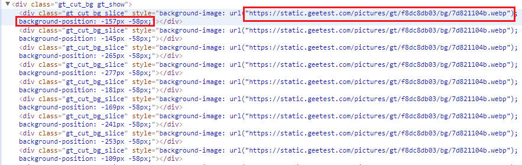

# GEETEST安全性及破解 #

- GEETEST是一种滑动验证码。用户通过拖动滑块至图片空缺位置即可通过验证。



## 优势 ##

- 采用**行为式验证**，除了依靠滑块的正确匹配，还考虑拖动过程的行为轨迹是否符合真人动作
- 用户体验好，验证过程简单快捷。
- 简单的一下拖动，后台却能提取超过40个变量，包括拖动位置、拖动速度等显性变量，和服务器的数据交换等隐性变量，以及一些随机性变量。基于以上行为变量，再通过极验核心的多重行为判别模型，使得后台能够区分出“人”与“恶意程序”。

## 通讯过程 ###

- 极验验证/网站主/客户浏览器三方的通讯时序图

     - 浏览器请求网站主页面
     - 网站主请求极验服务器做心跳检测
          - 判断极验SAAS服务是否正常
          - 获取必要的验证初始化工作
     - 极验心跳反馈
     - 启用正常（或者启用failback防宕机机制）
     - 页面初始化验证模块
     - 用户交互，浏览器上传行为数据到极验
     - 极验服务器分析给出结果到浏览器客户端
     - 浏览器提交数据到客户服务器
     - 客户端服务器使用SDK二次验证
     - 给出页面响应操作



- 在用户表单提交时，会额外提交三个字段，分别是 **geetest_challenge**, **geetest_validate**, **geetest_seccode**, 利用这三个字段，可以重新核对操作是否合法。

## 劣势 ##

- 前端信息采集加密对抗较弱
- 缺乏二次验证机制
- 更方便机器模拟验证过程进行破解


## 破解过程 ##

- 模拟点击动作，触发滑动验证码图片出现。保存，名为fullbg
    - 下载的图片并不是原图，而是由多个切分后的图片拼接而成。在网页上显示时是通过css的background-position属性对图片进行还原。

        - 以bilibili网站登录页面为例，查看网页元素可以直接得到验证图片,及每一小块的偏移量。每次图片打乱的规律相同，且未经过加密。通过简单的固定的图片裁剪拼接即可还原。
 
             - 验证图片 https://static.geetest.com/pictures/gt/ec93bce96/bg/4fe853147.webp
             
            
            
             - 每一小块图片的偏移量

            

- 模拟稍微移动滑动按钮，触发滑块出现。此时的图片存在滑块阴影空缺。保存，名为bg


- 比较两图片的像素差异即可得到最终滑块最终停止位置

- 如果没有fullbg，只需多次比较不同的bg，通过求交集亦可以获得最终滑块停止位置

- 模拟偏移过程 
    - 移动不能太快，也不能完全匀速，需要与真实用户的行为相近
    
    - 可以采集真实的鼠标移动数据进行模拟
    
    - 可以利用selenium进行模拟，具体参考[geetest滑动验证码破解成果](https://github.com/darbra/geetest)
    
    - 可以通过长周期小振幅的正弦函数模拟移动轨迹的y值，x值利用滑块最终停止位置确定生成的帧数不均匀增加。t随时间产生不均匀增加，并加入跳变。以此生成移动轨迹
    
    - 例，用以下代码进行模拟。摘自[破解极验(geetest)验证码-CSDN](http://blog.csdn.net/paololiu/article/details/52514504)

     ```java 
    
    # 鼠标点击元素并按住不放
    print "第一步,点击元素"
    ActionChains(driver).click_and_hold(on_element=element).perform()
    time.sleep(0.15)
    
    print "第二步，拖动元素"
    track_string = ""
    for track in track_list:
    track_string = track_string + "{%d,%d}," % (track, y - 445)
    # xoffset=track+22:这里的移动位置的值是相对于滑动圆球左上角的相对值，而轨迹变量里的是圆球的中心点，所以要加上圆球长度的一半。
    # yoffset=y-445:这里也是一样的。不过要注意的是不同的浏览器渲染出来的结果是不一样的，要保证最终的计算后的值是22，也就是圆球高度的一半
    ActionChains(driver).move_to_element_with_offset(to_element=element, xoffset=track+22, yoffset=y-445).perform()
    # 间隔时间也通过随机函数来获得
    time.sleep(random.randint(10,50)/100)
    print track_string
    # xoffset=21，本质就是向后退一格。这里退了5格是因为圆球的位置和滑动条的左边缘有5格的距离
    ActionChains(driver).move_to_element_with_offset(to_element=element, xoffset=21, yoffset=y-445).perform()
    time.sleep(0.1)
    ActionChains(driver).move_to_element_with_offset(to_element=element, xoffset=21, yoffset=y-445).perform()
    time.sleep(0.1)
    ActionChains(driver).move_to_element_with_offset(to_element=element, xoffset=21, yoffset=y-445).perform()
    time.sleep(0.1)
    ActionChains(driver).move_to_element_with_offset(to_element=element, xoffset=21, yoffset=y-445).perform()
    time.sleep(0.1)
    ActionChains(driver).move_to_element_with_offset(to_element=element, xoffset=21, yoffset=y-445).perform()
    
    print "第三步，释放鼠标"
    # 释放鼠标
    ActionChains(driver).release(on_element=element).perform()
    
    ```


## 参考 ##

- [极验验证可以被破解吗？-知乎](https://www.zhihu.com/question/28833985)
- [豆瓣登陆验证码的识别脚本](https://www.v2ex.com/t/138479)
- [极验(Geetest) Laravel 5 集成开发包，让验证更安全-Laravel学院](http://laravelacademy.org/post/5291.html)
- [破解极验(geetest)验证码-CSDN](http://blog.csdn.net/paololiu/article/details/52514504)
- [Laravel Geetest](https://github.com/Germey/LaravelGeetest)
