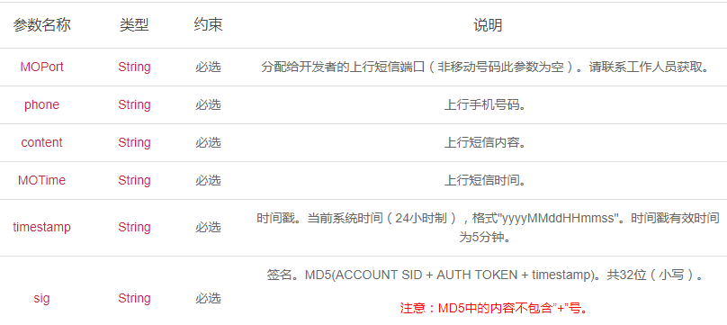
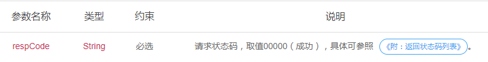
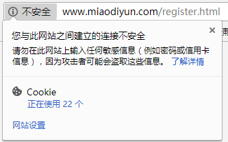
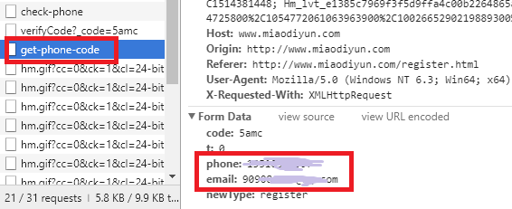
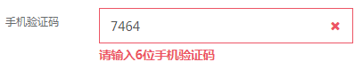
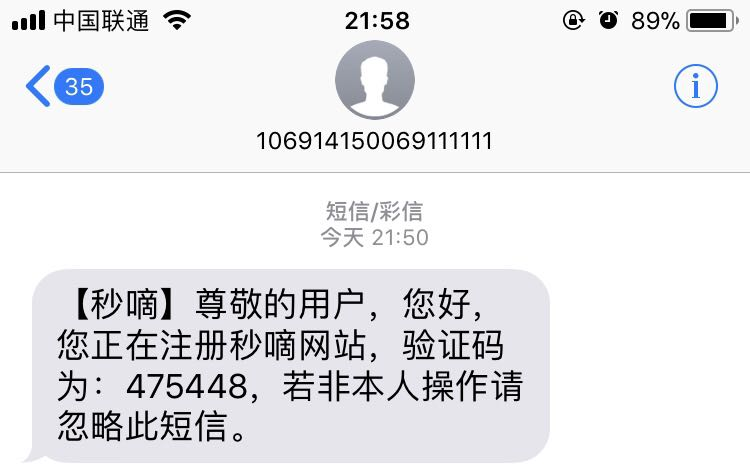
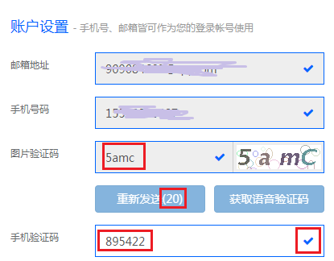
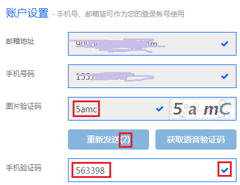
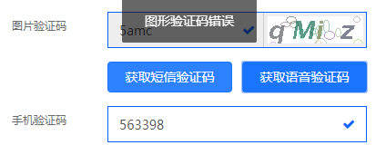
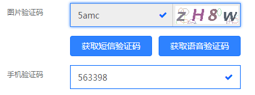

# 上行短信验证安全性分析 #

以[秒嘀科技](http://www.miaodiyun.com/doc/service_MO.html)的上行短信请求实例为例：

    POST /配置的回调地址
    Accept:application/json
    Content-Type:application/json;charset=utf-8
    
    {
    "MOPort": "6985",
    "phone": "138xxxxxxxx",
    "content": "content",
    "MOTime": "2015-06-29 19:23:26",
    "timestamp": "1435897700379",
    "sig": "23fbdb3d590cf755afcfe4b197099554"
    }

- 请求方式：POST

- 支持格式：JSON

- 请求参数说明：

- 返回参数：

- 安全性分析

相对上行短信，下行短信被攻击者直接获取对验证结果无直接影响。

下行短信的请求参数里包括时间戳与签名。时间戳与用户标识、用户身份令牌组合，经过MD5算法生成哈希签名发送给接收方。时间戳精确到秒，且5分钟有效。

当中间人拦截到此上行短信，在短时间内也无法进行哈希碰撞产生伪造的签名。从而无法伪造上行短信。因此上行短信在伪造方面是安全的。

但上行短信同下行短信一样，可能受到补卡攻击或克隆攻击。如果攻击者办一张和受害者相同的手机号（卡），就可以达到克隆的目的——接受受害者的验证码，以受害者的身份进行上行短信验证。

#### 测试 ####

依然用秒嘀科技网站测试。进行注册。
注册页面URL为不安全链接

填写邮箱手机号后，点击发送短信验证码按钮，网页会发送一条请求，返回用户输入信息，发送验证码。
可以看到用户信息以明文形式发送。

接收到6位验证码后，如果输入位数错误的验证码，前端会进行校验，提示错误信息

这个网站很诡异的一点是，我收到的验证码为

但是实际在网页中输入任何六位数字都可以通过

等待重新发送时间结束，请求获取语音验证码时，之前的图片验证码会进行刷新，提示图片验证码错误。

但是图片验证码输入框却不允许再次进行输入。从而无法获取语音验证码。只能刷新后重新输入信息，直接点击获得语音验证码。

但是在测试中，请求获取语音验证码后并未收到来电。等待重新发送时间结束，请求重新发送时，又出现了图片验证码刷新无法再次输入的问题。（这个网站真的莫名其妙。。）
